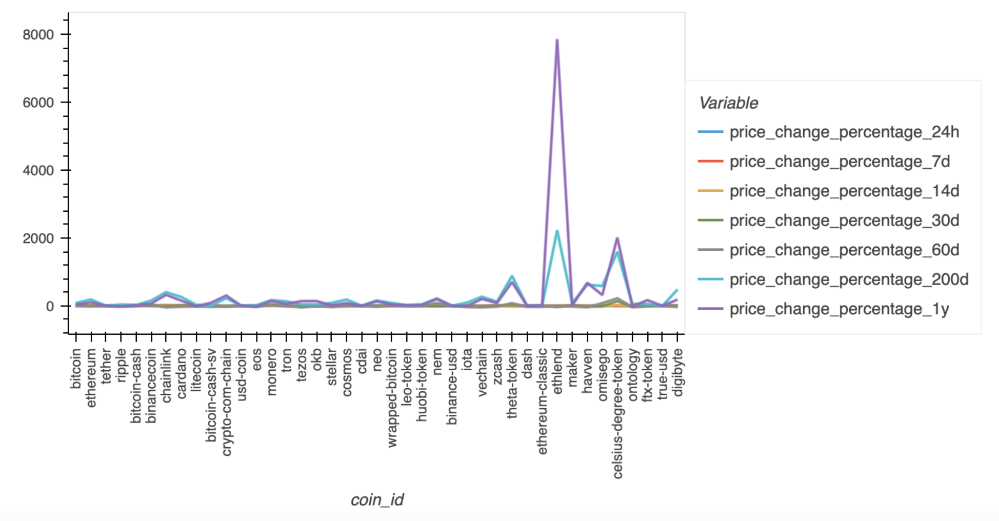
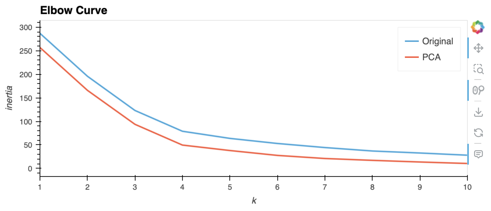
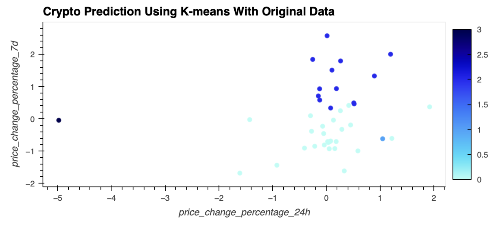
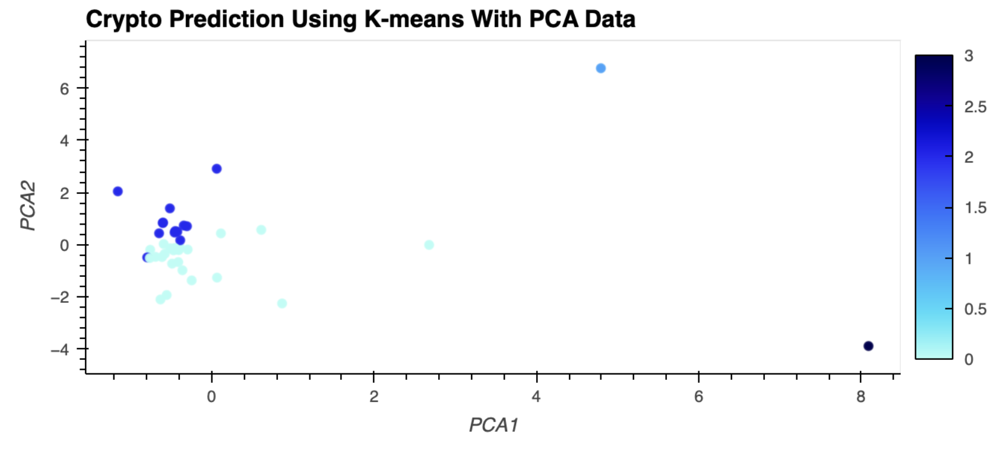

# CryptoClustering
KU Boot Camp Module 19 Challenge

## Overview
This project applies K-means clustering to cryptocurrency market data, comparing results from the original dataset and a dimensionally reduced version using Principal Component Analysis (PCA). The goal is to identify optimal groupings of cryptocurrencies based on their price change percentages.

## Requirements

1. Find the Best Value for k Using Original Data
2. Cluster Cryptocurrencies with K-Means Using Original Data
3. Optimize Clusters with Principal Component Analysis
4. Find the Best Value for k Using PCA Data
5. Cluster Cryptocurrencies with K-means Using PCA Data
6. Visualize and Compare Results

## Methodology

### 1. Finding Optimal k (Original Data)
- Implemented elbow method algorithm for k values 1 to 11
- Plotted line chart of inertia values
- Determined best k value

### 2. K-Means Clustering (Original Data)
- Initialized and fit K-means model with optimal k
- Predicted clusters and added to original dataset
- Created scatter plot of clustered data

### 3. PCA Implementation
- Created PCA model with 3 components
- Reduced features and analyzed explained variance
- Created new DataFrame with PCA data

### 4. Finding Optimal k (PCA Data)
- Repeated elbow method with PCA data
- Plotted inertia values
- Compared optimal k with original data results

### 5. K-Means Clustering (PCA Data)
- Applied K-means to PCA data
- Predicted clusters and visualized results

### 6. Result Comparison
- Created composite plots comparing original and PCA results
- Analyzed impact of dimensionality reduction on clustering

## Results

### Optimal k Value (Original Data)
**Q1: What is the best value for k using the original data?** 
A: 4

### PCA Analysis
**Q2: What is the total explained variance of the three principal components?** 
A: The three principal components together account for about 89.50% of the total variance in the original dataset.

### Optimal k Value (PCA Data)
**Q3: What is the best value for k when using the PCA data?** 
A: 4

**Q4: Does it differ from the best k value found using the original data?** 
A: No, the optimal number of clusters remains the same whether you are using the original data or the PCA-transformed data.

### Impact of Dimensionality Reduction
**Q5: After visually analyzing the cluster analysis results, what is the impact of using fewer features to cluster the data using K-Means?** 
A: The clusters formed using PCA data appear to be more compact and well-defined. This suggests that the PCA transformation has helped to reduce noise and focus on the most significant patterns in the data. The consistency in the optimal k value, between the original dataset and the PCA data, suggests that the essential clustering structure has been preserved.

## Visualizations

### Data Preview

Before applying any scaling or clustering algorithms, here's a preview of the initial cryptocurrency dataset: 

This dataframe contains various features of different cryptocurrencies, including price change percentages over different time periods.

### Elbow Curve Comparison

### Cluster Visualization Comparison

The last two visualizations demonstrate the differences in clustering results between the original and PCA-transformed data, allowing for a clear comparison of the impact of dimensionality reduction on the cryptocurrency clustering analysis.
